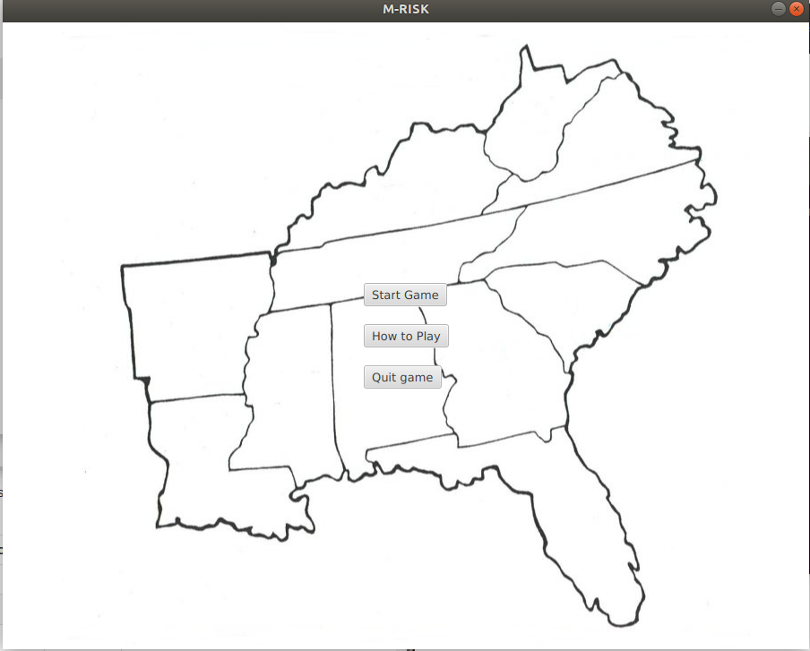
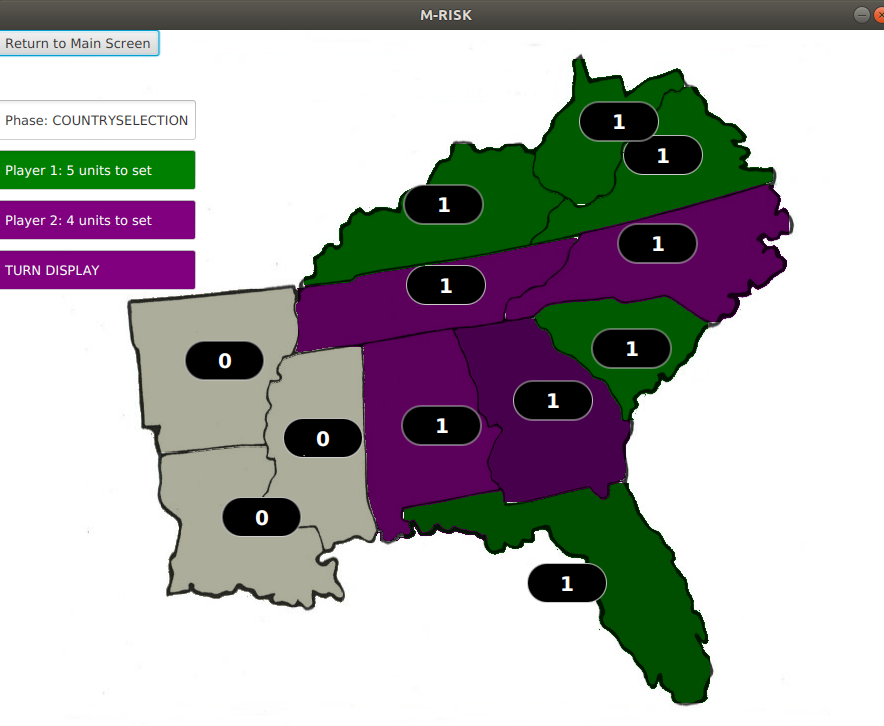

# Instructions

Download the file [MRisk_1.3.jar](https://github.com/learntopilk/ot_harjoitustyo/releases/download/1.3/MRisk-1.3.jar )

### Configuring the environment

No configurations should be needed (that I know of).

### Starting up the game

Basically just cd into the directory where the jar is located, and punch in the following spell:

```
java -jar MRisk_1.3.jar
```

This is what you will see:


Press _Start Game_ to `Start the Game`.

### Playing the game
You'll see this:


Or almost. in the beginning, all countries are beige. Two players will pick countries one by one.

After all countries are selected, the troop value (not displayed yet) of each country will be added up. This is the number of troops each player can deploy.

Units are deployed one by one, turn by turn.

Full game instructions are included in the game.