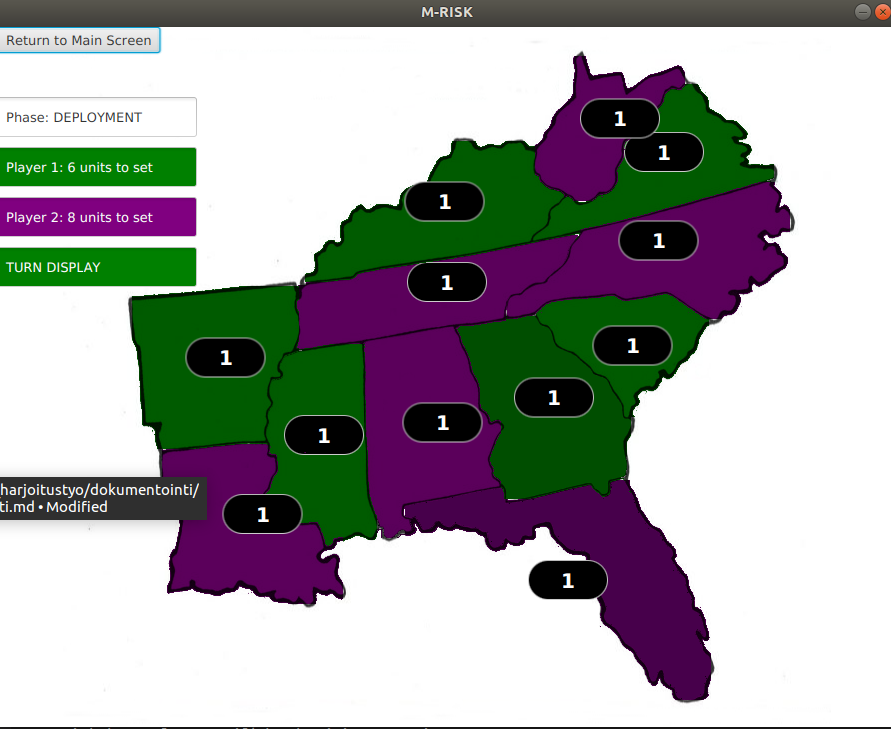

# Project requirements and definitions: MRisk

..i.e. Mini-Risk.

### Purpose

MRisk is a Risk clone. Two players fight each other for control of the Southeastern United States. At the beginning of each turn, the players receive a number of units to deploy, depending on how many and which states they currently control

The game ends when only one player remains.

### Users

Only one user role exists: That of a unnamed player, represented by a color.

### Views

The application has three views.

#### Main menu

Contains buttons for starting the game, reading instructions, and exiting the game.

#### Instruction view

Contains instructions for playing the game, as well as a button for returning to main menu.

#### Game View

Displays the game map in the middle, with colored countries representing ownership by payers. The left side of the screen contains, in the following order:

- `Back to main menu`
- `End Turn` (Visible only during attack phase)
- A text field describing game phase
- two fields showing the number of troops each player can deploy
- A field displaying the color of the player whose turn it currently is.

### Minimum requirements:

- Two human players can match against each other
    - The players can pick which states they want to start with.
- The map is represented by a CSV, which can be changed relatively easily (provided appropriate images are provided)
- The players get troops according to the states they control at the start of eac turn
- In the attack phase, players can either attack enemy states or move their troops to another country they own
- Each country/state must always have at least one troop stationed. If there is only one troop, no attacks can be made starting with that state.
- The players can read basic instructions on how to play the game

### Known issues:
- The "end game" button only shows up after the first click on each turn

### Ideas for expanding and improving
- A text field for specifying the file from which the map is loaded
- A larger default map, accommodating up to 4 players
- Dynamic player creation, allowing anywhere from 2-4 players
- Nicknames for players
- Saving game states
