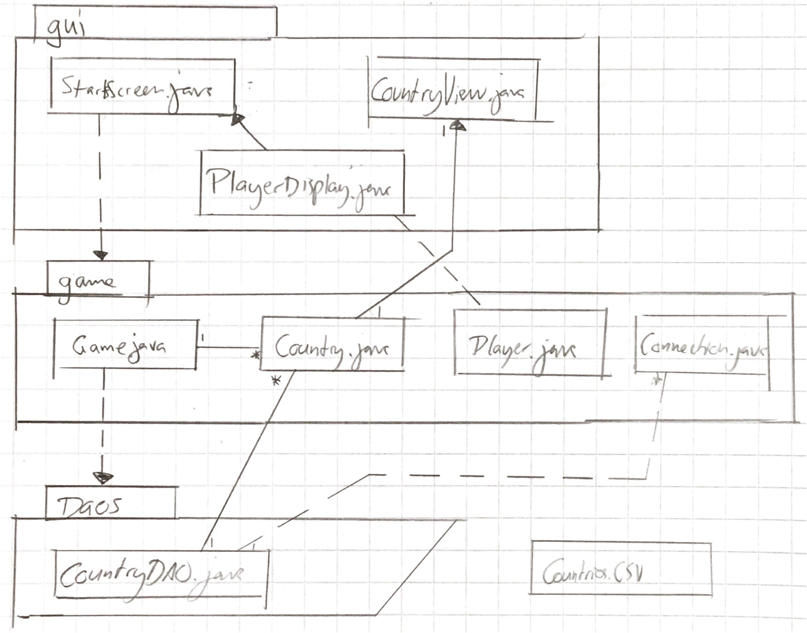
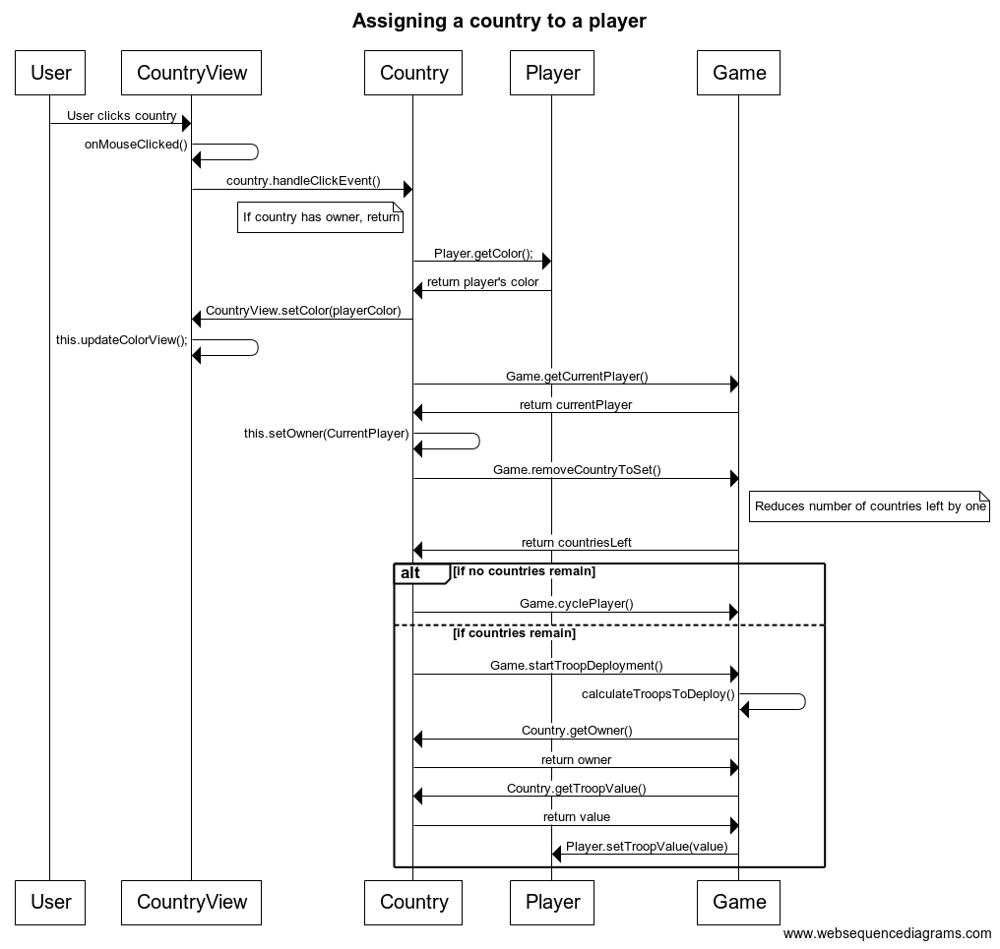

# MRisk architecture

MRisk is a Java-based Risk clone, made with JavaFX. It attempts to work with a layered architecture, as demonstrated below:

TODO NEW IMAGE


## User Interface

The UI is built with JavaFX. There are three views:

1. Start screen
2. Game Screen
3. Instruction Screen 

Each of these is a Scene object, of which one is always set to the Stage of the application. Most of the UI lies in the class StartScreen.java.

While I have tried to keep application an UI logic isolated, this is not fully the case currently (it's not easy. Who knew?). The UI calls the method that starts the game.

Different stages/views are generated by different methods in StartScreen.java.

The map, and the countries, are represented by CountryView objects, which contain ImageViews with event handlers. These handlers call each country's handlers to handle the handlable events, i.e. to select the country, to attack a country, and so on.

In addition, there are a few informative fields on the game screen, handled by the poorly named __PlayerDisplay.java__. These contain information on troops to be deployed, current phase, and the player in currently in turn.


## Application Logic


The class __Game__ contains most of the controlling logic of the game. A central mechanic is that of game phases, of which there are four:

- Country selection
- Troop deployment
- Attack phase.
- GAME OVER phase (not a real phase, but is represented by the same phase string.)

The class __Player__ contains player-specific data. For the most part, the purpose of the Player is to mark turns and keep count on troop deployments.

__Country.java__ takes care of countries, and manages the various country views by implementing event handler methods. This is by far the most messed-up class, and is deeply entangled with Game, CountryView, and PlayerDisplay.

__Connection.java__ is a helper class which represents connections between two states/countries. It is only used by __CountryDAO.java__.

__CountryDAO.java__ parses countries and their connections together.

## Files

The software uses a file called _countries.csv_ for generating the main map of the game.

### Map generation

Countries/states and thus maps are stored as CSV files. The format is as follows: 

```
Florida;2;/florida.png;453d;408d;Alabama;Georgia;
Georgia;1;/georgia.png;289d;460d;Florida;Alabama;South%20Carolina;North%20Carolina;Tennessee;
```

The data is in the following order:
1. Name of the country/state - Spaces must be URL-encoded
2. Troop value - how many troops owning this state is worth
3. URI of the image that represents the state
4. Offset X value of the image on the screen
5. Offset Y value of the image on the screen
6. All Neighboring states for this particular country.

Hypothetically, this makes it easy to add new maps. However some parts of map generation are hard-coded still, so a small refactoring effort is required to accommodate for that. In addition, the file is part of the .jar for now.

## Sequence diagram

Thus we assign a country to a player:



## Weaknesses

- Players can attack whichever country they choose. We know what the neighbors of each country are, but as of now cannot do anything with that information.
- The code is messy and UI elements should be better separated from the application logic.