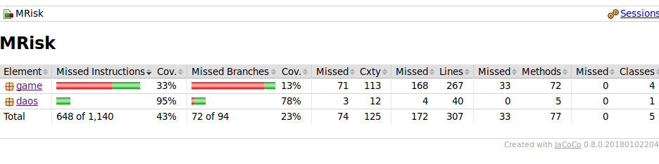

## Testing

The application suffers from a very poor test coverage. There are a few reasons for this:

- Time limitations
- Lack of architectural planning skills.
- Lack of expertise with the testing tool.

Simply put, the app turned into spaghetti and it became very difficult to test anything with JUnit.

## System Testing

I have tested the app on Linux (Ubuntu) and Windows 10. The app worked in both environments.

### Installation 

There are no special procedures to installing the app. Just download and run it.

### Functionality

Most of the application works fine. It has the following flaws:

1. Players can move units to whichever state/country they want to. In a real Risk game, each unit may only move once per turn.
2. The "End turn" button disappears at the start of each turn, and only appears after the player whose turn it is clicks somewhere on the map. This is not serious, but it is annoying.